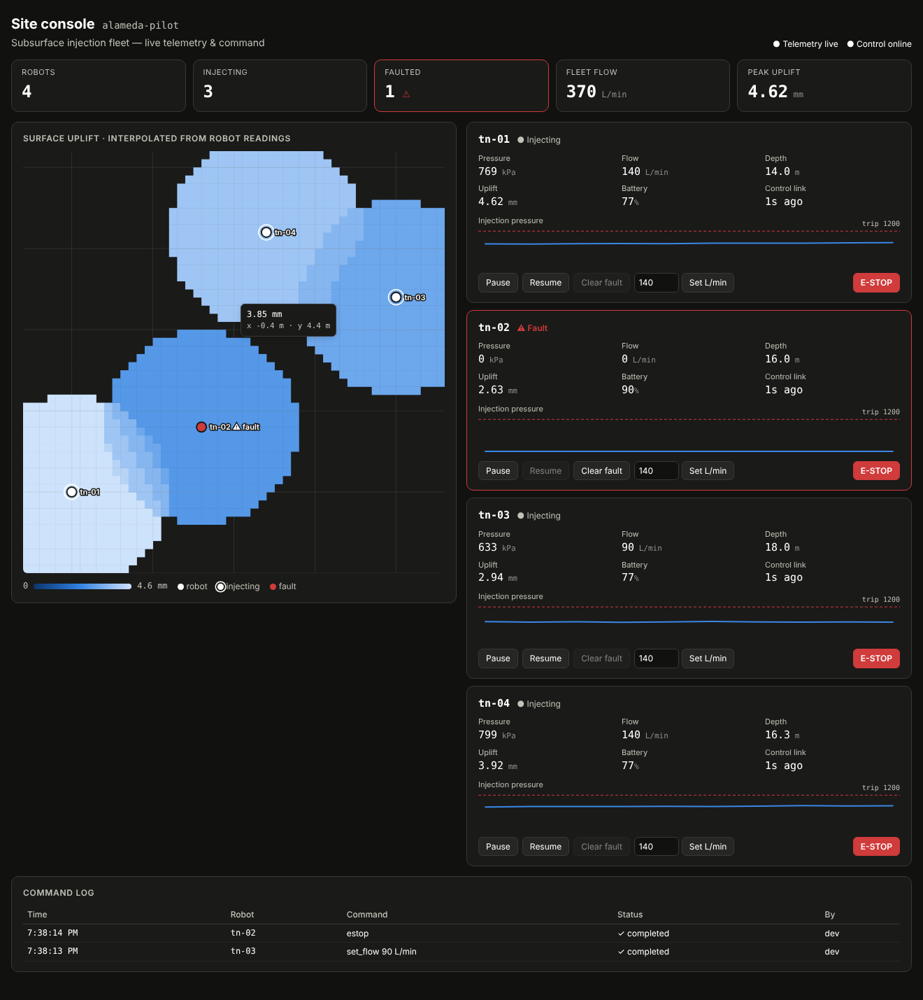
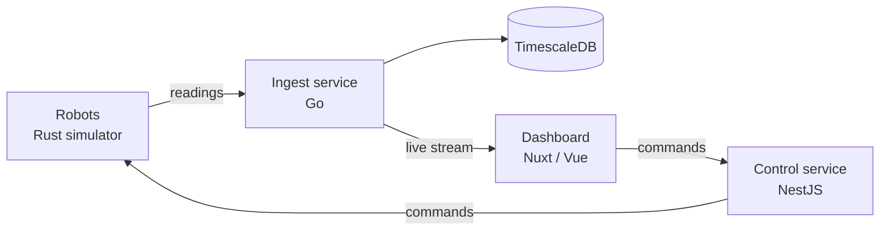

# Terraform Fleet

**Software for a fleet of robots that lift flood-prone land.**

Terranova lifts land by drilling underground and injecting wood-waste slurry, which makes the ground rise. This project is the software side of that work, built end to end:

- simulated robots that do the drilling and injecting
- a backend that collects their data and sends them commands
- a live dashboard for the people operating the site
- the cloud and CI setup to ship all of it

It was built as a portfolio project for Terranova's Software Engineering Intern role.



## How it works



1. **Robots report in.** Every second, each robot sends its pressure, flow rate, depth, battery and how much the ground above it has risen.
2. **The ingest service checks and stores the readings.** Impossible values, such as negative depth or a battery over 100%, are rejected one row at a time, so one bad reading doesn't lose the whole batch. Good readings are saved to a time-series database and streamed live to the dashboard.
3. **Operators watch the dashboard.** It shows a live map of how much the ground has risen, a card for each robot, and a log of every command.
4. **Operators send commands.** Pause, resume, change flow rate, clear a fault, or emergency stop. The control service queues each command, the robot picks it up and applies it, and the robot confirms whether it succeeded.

## Tools used

| Area | Tools |
|---|---|
| Frontend | Vue 3, Nuxt 4, TypeScript, HTML canvas and SVG charts |
| Backend | Go (ingest), NestJS/TypeScript (control), Rust (robot simulator) |
| Data | PostgreSQL with TimescaleDB, plus Server-Sent Events for live updates |
| Monitoring | Prometheus metrics, Grafana dashboard, structured JSON logs |
| Cloud | Terraform for AWS (ECS Fargate, RDS, load balancer, Secrets Manager, ECR) |
| Delivery | Docker, docker-compose, GitHub Actions CI |

## The four parts

**Robot simulator (Rust).** It stands in for real hardware. The ground lift uses a standard geophysics model (the Mogi model), and a test checks the math against the known formula. Each robot works through move → drill → inject, with realistic faults: it trips if pressure gets too high and stops if its battery runs low.

**Ingest service (Go).** It receives readings, validates them, writes them to the database in bulk, and streams them live to the dashboard. The service also uses TimescaleDB's compression and automatic deletion of old data when the extension is installed; on plain Postgres it runs without them.

**Control service (NestJS).** It tracks every command from *queued* to *sent* to *completed* or *rejected*. Safety rules are built in:
- An emergency stop jumps the queue and cancels everything waiting behind it.
- Commands the robot never confirms expire, so no one assumes a command worked when it didn't.
- After a fault is cleared, the robot stays paused until a person resumes it.
- Every action is logged with who did it.

**Dashboard (Nuxt/Vue).** It shows live readings, a ground-lift heatmap and the robot controls. The operator's API key stays on the server, so it never reaches the browser.

## What this shows

- **It works end to end.** All four parts were run together: commands sent from the dashboard reached the robots, and their readings flowed back.
- **It's tested.** There are 75 tests across Go, Rust and TypeScript. The database tests run against a real TimescaleDB in CI.
- **It has CI/CD.** Every push runs lint, type checks and tests for each service, validates the Terraform, and builds Docker images for both x86 and ARM.
- **It treats safety and security seriously.**
  - Validation happens at the edge, before anything is stored.
  - Operators and robots use separate role-based API keys.
  - Secrets live in Secrets Manager, not in code or Terraform state.
  - Deploys use short-lived GitHub OIDC credentials.
- **The trade-offs are stated openly.** For example, the control service's queue lives in memory, so it runs as exactly one copy. That limit is written down, along with how to remove it.

## Run it

```bash
docker compose up --build
```

| Open | URL |
|---|---|
| Dashboard | http://localhost:3000 |
| Grafana | http://localhost:3002 |
| Prometheus | http://localhost:9090 |

Each service also runs on its own and has a short README in its folder: `services/`, `sim/`, `apps/`, `infra/`.

## Next steps

- Store the command queue in Postgres, so the control service can run as more than one copy and survive restarts.
- Give each robot its own identity (mTLS or AWS IoT Core) instead of a shared fleet key.
- Add single sign-on to the dashboard, so the audit log names the person behind each command.
- Put a durable buffer in front of the ingest service, so field data survives database maintenance.
