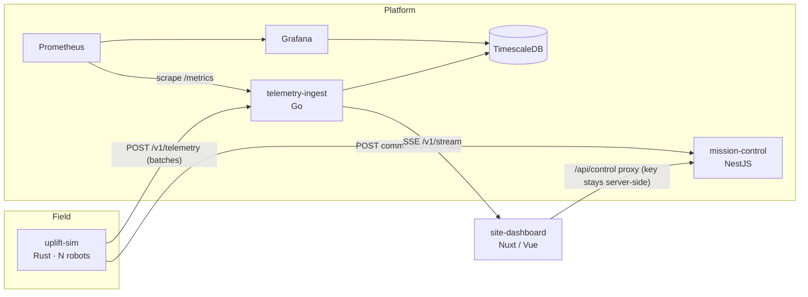

# Terraform Fleet — a software stack for land-lifting robots

A portfolio project built for **Terranova's Software Engineering Intern** role. It is a small but complete platform for a fleet of subsurface injection robots, the kind of system Terranova builds to lift flood-prone land: robots drill, inject wood-waste slurry, and the ground rises.

It covers the parts of the job the posting describes: **web apps (Vue/Nuxt/TypeScript)**, **distributed backends (Go, NestJS, Rust)**, **Postgres/TimescaleDB**, **cloud infrastructure as code**, **CI/CD and observability**, and **integrating robot telemetry and control interfaces**.


*Live run: tn-02 was e-stopped from the dashboard. tn-03's flow setpoint was lowered to 90 L/min. Both commands went operator → mission-control → robot and were acknowledged.*

---

## How it maps to the role

| What the role asks for | Where it is in this repo |
|---|---|
| Vue / Nuxt / TypeScript frontends | [`apps/site-dashboard`](apps/site-dashboard): Nuxt 4 ops console with a live SSE feed, canvas heatmap, SVG sparklines and operator controls |
| Backends in Go | [`services/telemetry-ingest`](services/telemetry-ingest): batch ingestion, validation, SSE fan-out, Prometheus metrics |
| Backends in NestJS | [`services/mission-control`](services/mission-control): command & control API with role-based auth, a command lifecycle state machine and an audit log |
| Backends in Rust | [`sim/uplift-sim`](sim/uplift-sim): a robot fleet and ground-deformation simulator that speaks both APIs |
| Postgres / TimescaleDB | Hypertable with compression and retention policies, `date_bin` bucketing, a trapezoidal volume integral in SQL, and a contract test run against a real DB |
| Cloud infra layer | [`infra/terraform`](infra/terraform): AWS VPC, ECS Fargate (Graviton), ALB, RDS, Secrets Manager, ECR, least-privilege IAM, GitHub OIDC deploy role |
| CI/CD | [`.github/workflows/ci.yml`](.github/workflows/ci.yml): per-service lint, typecheck and test, a TimescaleDB service container, Terraform validate, multi-arch image builds |
| Observability | Prometheus metrics (ingest rate, rejects by reason, p95 latency, per-robot uplift), a provisioned Grafana dashboard, structured JSON logs |
| Integrating telemetry, data and control with robotics | The simulator posts telemetry and pulls commands the way a robot on a field LTE link would. Safety rules (e-stop pre-emption, pressure trip, ack timeouts) are enforced on both sides |

## Architecture



**Data path:** robots batch-upload samples → ingest validates each row against physical bounds → valid rows are written to TimescaleDB with `COPY` and fanned out over SSE → the dashboard folds them into fleet state and redraws once per animation frame at most.

**Control path:** an operator issues a command → mission-control queues it per robot → the robot polls, gets it (an e-stop always jumps the queue), applies it, and acks `completed` or `rejected` with a reason. Every transition is in the audit log with who caused it.

## The projects

### 1. `telemetry-ingest` (Go)
- **Partial acceptance.** One bad sensor reading doesn't drop a whole batch from a robot on a flaky link. The response lists rejected rows by index.
- **Validation at the edge:** finite numbers, physical bounds (pressure, flow, depth, battery), and clock-skew limits.
- **Two stores behind one interface** (in-memory and Postgres), held to the same **contract test**. The Postgres run executes against a real database locally and in CI.
- **TimescaleDB when available.** The schema promotes the table to a hypertable with compression (segment by robot) and 365-day retention, and falls back to plain Postgres (for example on RDS) without code changes.
- **Non-blocking SSE hub.** Slow dashboard clients drop samples (and the drop is counted in a metric) instead of back-pressuring ingest.
- Graceful shutdown, DB connect retry, and `-race`-clean tests.

### 2. `mission-control` (NestJS / TypeScript)
- Command lifecycle: `queued → sent → completed | rejected`, plus `cancelled` and `expired`.
- **Safety rules:**
  - An e-stop cancels everything queued behind it, jumps the queue, never expires, and is accepted even when the queue is full.
  - Clearing a fault leaves the robot *paused*, so a person has to resume it on purpose.
  - Unacked commands expire, so nobody assumes a command landed when it didn't.
- **Auth.** Bearer keys with roles (`operator` / `robot`), compared in constant time. Each operator key has a name, so every audit entry can be traced to a person.
- DTO validation with whitelisting (unknown fields are rejected). An injectable `Clock` makes the expiry logic testable without sleeps.

### 3. `uplift-sim` (Rust)
- **Real geophysics.** Surface uplift uses the **Mogi point source** in an elastic half-space, superposed over every injection. A test checks it numerically against the closed-form result (∫u dA = 2(1−ν)ΔV).
- **Injection pressure model:** overburden breakdown + flow resistance + formation stiffening as the zone fills.
- **Per-robot state machine:** move → drill → inject → retract, with overpressure trips, low-battery faults, and operator commands layered on top.
- Deterministic by seed (its own xorshift PRNG). Time compression only affects the physics: timestamps stay wall-clock, so ingest's clock-skew check still holds.

### 4. `site-dashboard` (Nuxt 4 / Vue 3 / TypeScript)
- **Live uplift heatmap**, IDW-interpolated from what robots measured. The dashboard deliberately knows no physics. It uses a validated single-hue sequential ramp that is reversed in dark mode, so zero recedes in both themes.
- **Per-robot cards:** pressure sparkline with the trip line and a hover crosshair, a "stale" badge, and control-link age.
- Operator controls go through a **same-origin Nitro proxy**, so the operator API key never reaches the browser.
- Handles out-of-order samples (reconnect replays) without rolling back the latest view. Fault state is shown with an icon and label, never by color alone. Works at phone width.

### 5. Infra, CI/CD and observability
- `docker compose up --build` runs the whole stack locally, including TimescaleDB, Prometheus and a pre-provisioned Grafana dashboard.
- **Terraform for AWS:**
  - Private subnets and NAT; ECS Fargate on arm64 with deployment circuit-breaker rollback; an ALB with path routing and an idle timeout long enough for SSE.
  - RDS with Multi-AZ and deletion protection in production; secrets come from Secrets Manager and never land in Terraform state.
  - ECR with immutable tags and scan-on-push; a GitHub OIDC deploy role scoped to `main`, with no long-lived keys.
- mission-control is pinned to exactly one replica (`maximum_percent = 100`) because its queue is in memory. This trade-off is called out explicitly, not hidden.

## Run it

```bash
docker compose up --build
# dashboard  http://localhost:3000
# grafana    http://localhost:3002   (Fleet ops dashboard)
# prometheus http://localhost:9090
```

Or run each piece without Docker:

```bash
# 1. ingest (in-memory store if DATABASE_URL is unset)
cd services/telemetry-ingest && go run ./cmd/ingest
# 2. control plane
cd services/mission-control && npm ci && npm run build && npm start
# 3. robots
cd sim/uplift-sim && cargo run --release -- --ingest-url http://localhost:8080 --control-url http://localhost:3001
# 4. dashboard
cd apps/site-dashboard && npm ci && npm run dev
```

Send a command the way an operator would:

```bash
curl -XPOST localhost:3001/v1/robots/tn-02/commands \
  -H 'Authorization: Bearer dev-operator' -H 'content-type: application/json' \
  -d '{"type":"set_flow","params":{"flow_lpm":90}}'
```

## Tests

| Project | What's covered | Command |
|---|---|---|
| telemetry-ingest | validation table, store contract (memory **and** Postgres), SSE hub drop semantics, HTTP API incl. a live SSE round trip and `/metrics` | `go test -race ./...` (`TEST_DATABASE_URL=… ` for Postgres) |
| uplift-sim | Mogi closed form and volume integral, superposition, state-machine transitions, overpressure and e-stop flows, wire-format compatibility | `cargo test` |
| mission-control | lifecycle, e-stop pre-emption, TTL and ack expiry, audit trail, auth (401/403), validation, full HTTP round trip | `npm test` |
| site-dashboard | out-of-order fold, history bounds, survey dedupe, IDW, color ramp | `npm test` |

That is 75 test cases in all. They also ran end to end against each other: sim → ingest → Postgres → SSE → dashboard, with commands sent from the dashboard through mission-control back to the robots.

## Trade-offs and next steps
- **mission-control persistence.** Move the queue to Postgres (`SELECT … FOR UPDATE SKIP LOCKED`) so it can run more than one replica, and survive restarts.
- **Robot identity.** Replace the shared fleet key with per-device mTLS (or AWS IoT Core), so a command can only be acked by the robot it was meant for.
- **Operator attribution through the dashboard.** Put the console behind SSO (ALB OIDC) and forward the signed-in user to mission-control, so audit entries name a person, not the dashboard's key.
- **Telemetry at scale.** Use Timescale continuous aggregates for the series endpoint, and put a durable buffer (NATS JetStream / Kinesis) in front of ingest so field uploads survive DB maintenance.
